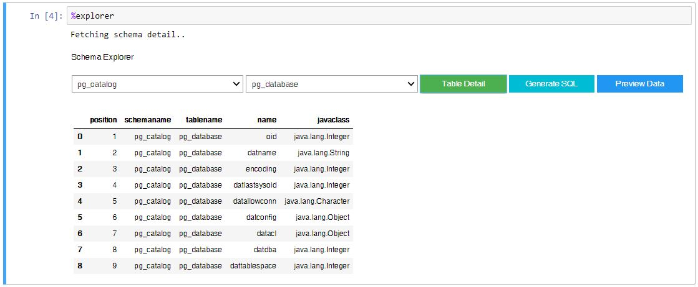
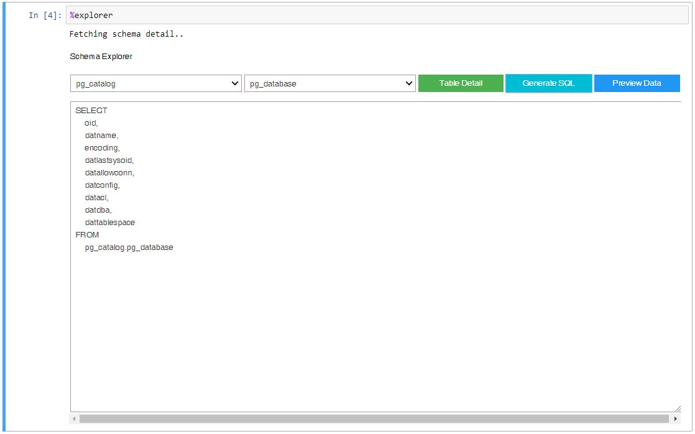
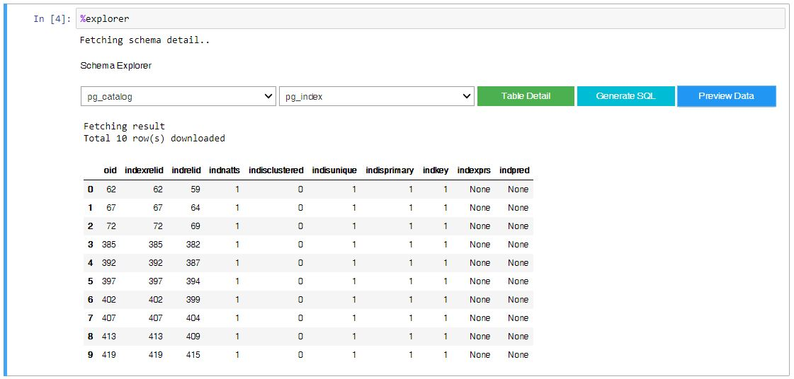

# Ipython ODBC SQL Magic

Run SQL directly from Jupyter Notebook cell using ODBC without SQLAlchemy

## Installation

### Latest Development
```bash
$ pip3 install https://gitlab.com/wakataw/ipython-dawet-sql/-/archive/master/ipython-dawet-sql-master.zip --user
```

### Spesific Tag
```bash
$ pip3 install https://gitlab.com/wakataw/ipython-dawet-sql/-/archive/<tag>/ipython-dawet-sql-<tag>.zip
```

You can find available tag [here](https://gitlab.com/wakataw/ipython-dawet-sql/tags)

## Usage

### Load Extention
```
%load_ext dawetsql
```

### Database Connection

#### Open Connection Using Line Magic
```
%dawetsql --dsn dsnname --user username --password secretPassword
```

Available arguments

Arguments | Type | Default | Descriptions
---|---|---|---
`-c --chunksize` | Integer | 100 | Set ODBC Fetch Size
`-x --connection` | String | None | ODBC Connection String (Not Implemented)
`-a --reconnect` | Boolean | False | Try to reconnect if session expired 
`-r --retry` | Integer | 3 | Maximum reconnect retry


#### Close Connection

```
%dawetsqlclose
```

### Reconnect 

```
%dawetsqlreconnect
```

### Run SQL Query

```
%%dawetsql
SELECT * FROM tables
WHERE somecolumn = 'somevalue'
```

Query Results Preview is presented using pandas dataframe with default limit 10 rows.
You can access preview dataframe within notebook by calling `_` variable.

Available arguments

Arguments | Type | Default | Descriptions
---|---|---|---
`-l --limit` | Integer | 10 | Limit Query result preview
`-o --output` | String | `_` | Result output. Currently only support exporting result to variable, csv, and pickle

### Cell Magic Advance Usage

#### Store Query Result to Variable

```
%%dawetsql --ouput variablename
SELECT * FROM tables
WHERE somecolumn = 'somevalue'
```

#### Export Query Result to CSV

```
%%dawetsql --output filename.csv
SELECT * FROM tables
WHERE somecolumn = 'somevalue'
```

#### Export Query Result to Pickle

```
%%dawetsql --output picklename.pkl
SELECT * FROM tables
WHERE somecolumn = 'somevalue'
```

### Widgets

#### Schema Explorer Widget

Widget that help you explore database schema, table, columns name and type.

```
%explorer [-f --force]
```

**Table Detail**




**Query Builder**




**Table Data Preview**




### Settings

You can find **ipython-dawet-sql** settings file in `~/.dawetsql/settings.ini`. Currently, it is used only to store database schema query string.

## Legal

This package is released under MIT License
