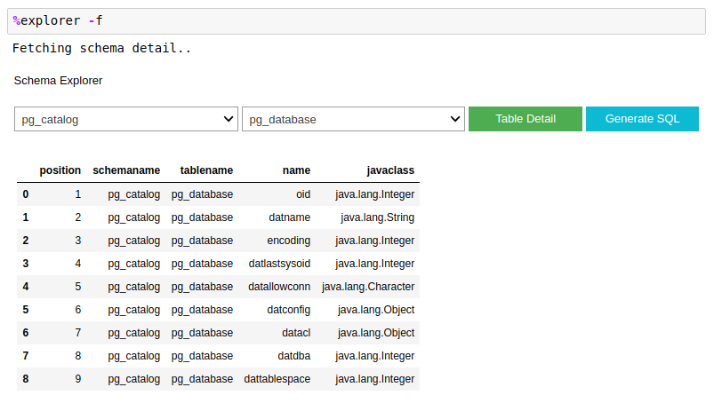
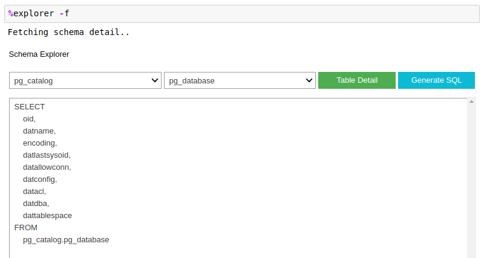

# Ipython ODBC SQL Magic

Run SQL directly from Jupyter Notebook cell using ODBC without SQLAlchemy

## Installation

### Latest Development
```bash
$ pip3 install https://gitlab.com/wakataw/ipython-dawet-sql/-/archive/master/ipython-dawet-sql-master.zip --user
```

### Spesific Tag
```bash
$ pip3 install https://gitlab.com/wakataw/ipython-dawet-sql/-/archive/<tag>/ipython-dawet-sql-<tag>.zip
```

You can find available tag [here](https://gitlab.com/wakataw/ipython-dawet-sql/tags)

## Usage

### Load Extention
```
%load_ext dawetsql
```

### Database Connection

#### Open Connection Using Line Magic
```
%dawetsql dsn
```

This is optional, you can pass parameter from `%%dawetsql` cell magic while executing query.

#### Set Chunk Size

By default, `dawetsql` set chunk size to 500 rows. You can change it by passing `-c` or `--chunksize` arguments

```
%dawetsql -c 100 dsn
```


#### Close Connection

```
%dawetsqlclose
```

### Run SQL Query

```
%%dawetsql
SELECT * FROM tables
WHERE somecolumn = 'somevalue'
```

Query Results Preview is presented using pandas dataframe with default limit 10 rows.
You can access preview dataframe within notebook by calling `_` variable.

### Cell Magic Advance Usage

#### Start Connection and Run Query

```
%%dawetsql -x dsn
SELECT * FROM tables
WHERE somecolumn = 'somevalue'
```

#### Store Query Result to Variable

```
%%dawetsql --ouput variablename
SELECT * FROM tables
WHERE somecolumn = 'somevalue'
```

#### Export Query Result to CSV

```
%%dawetsql --output filename.csv
SELECT * FROM tables
WHERE somecolumn = 'somevalue'
```

#### Export Query Result to Pickle

```
%%dawetsql --output picklename.pkl
SELECT * FROM tables
WHERE somecolumn = 'somevalue'
```

### Widgets

#### Schema Explorer Widget

Widget that help you explore database schema, table, columns name and type.

```
%explorer [-f --force]
```

> Table Detail




> Query Builder




### Settings

You can find **ipython-dawet-sql** settings file in `~/.dawetsql/settings.ini`. Currently, it is used only to store database schema query string.

## Legal

This package is released under MIT License
